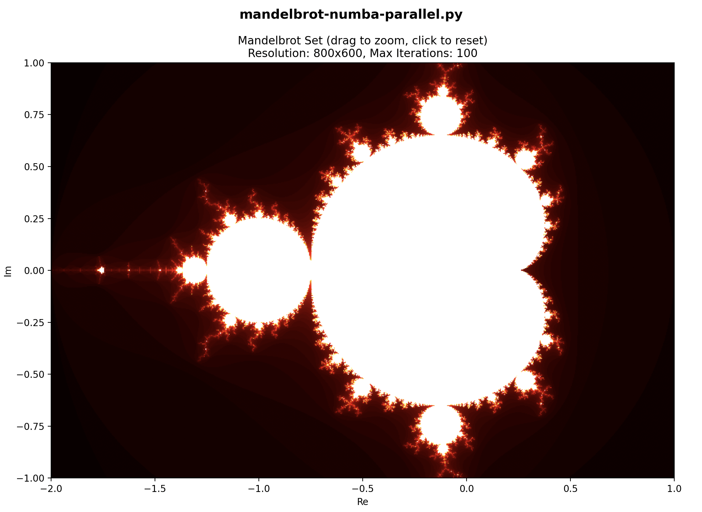
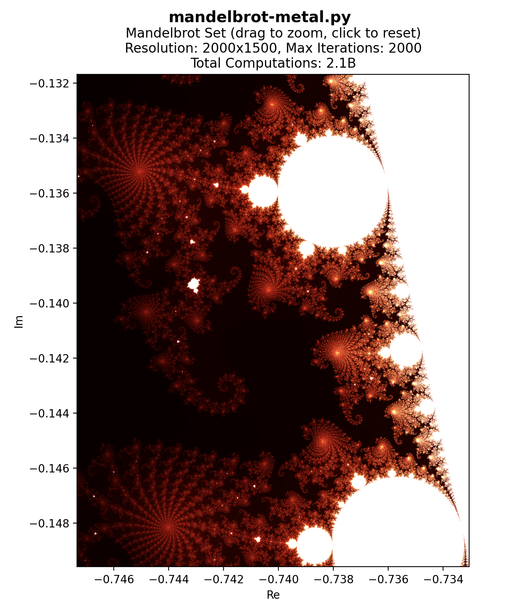
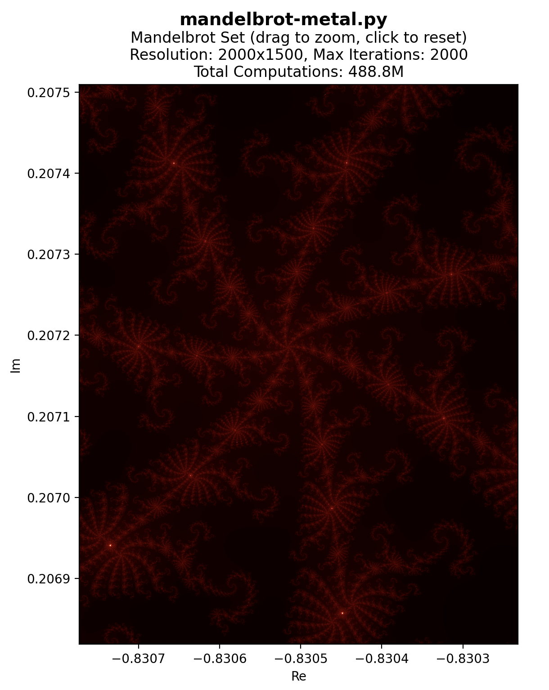

# Mandelbrot Set Computation Benchmark

This project implements and benchmarks various approaches to computing the Mandelbrot set, exploring different programming languages and optimization techniques.

## Performance Summary

Latest benchmark results (average computation time in seconds):

| Rank | Implementation    | Easy   | Medium | Hard    |
|------|------------------|--------|--------|---------|
| 1    | Metal (GPU)      | 0.0029 | 0.0042 | 0.0234  |
| 2    | Rust             | 0.0138 | 0.0475 | 1.3709  |
| 3    | Numba Parallel   | 0.0638 | 0.0847 | 0.9253  |
| 4    | Numba            | 0.0779 | 0.1822 | 5.0108  |
| 5    | NumPy            | 0.2086 | 0.7475 | 30.4738 |
| 6    | Codex (OOP-impl) | 0.2886 | 0.7662 | 28.2540 |
| 7    | Python Parallel  | 0.5938 | 1.0478 | 25.0336 |
| 8    | Torch (GPU)      | 1.7891 | 4.5363 | 62.1589 |
| 9    | Pure Python      | 1.1413 | 4.7807 | 93.8319 |

- Lower is better. All times in seconds. All implementations tested on all presets.

Metal (GPU) is consistently fastest, followed by Rust and Numba (parallel). Pure Python and Torch are the slowest, especially for harder presets.

## Mandelbrot Set Visualizations

### Numba Parallel Implementation


### Metal Implementation



## Implementations

The project includes several implementations of the Mandelbrot set computation:

1. **Python Implementations**:
   - `mandelbrot-vanilla.py`: Pure Python implementation
   - `mandelbrot-numpy.py`: Using NumPy for vectorized computation
   - `mandelbrot-numba.py`: JIT-compiled Python using Numba
   - `mandelbrot-numba-parallel.py`: Parallel Numba implementation
   - `mandelbrot-parallel.py`: Python multiprocessing implementation
   - `mandelbrot-torch.py`: PyTorch GPU implementation
   - `mandelbrot-metal.py`: Apple Metal GPU implementation

2. **Rust Implementation**:
   - `mandelbrot_rust/`: Parallel Rust implementation using rayon
   - Exposed as a Python module for easy benchmarking

## Performance Tracking

The project includes a logging system that tracks computation times for each implementation across different presets:
- Easy: Basic computation parameters
- Medium: More complex parameters
- Hard: Most demanding parameters

Results are logged to `mandelbrot.log` and can be viewed using the `print_stats()` function in `src/infrastructure/logger.py`.

## Requirements

This project includes several implementations, each with its own dependencies. Below is a breakdown by implementation:

### General
- **Python 3.8+**
- **pip** (for Python package management)

### Python Implementations
- **NumPy** (`numpy>=1.21`): Core array operations for most implementations.
- **Numba** (`numba>=0.56`): JIT compilation for fast CPU and parallel execution (Numba and Numba Parallel).
- **PyTorch** (`torch>=2.0`): GPU acceleration for the PyTorch implementation (supports CUDA and Apple MPS backends).
- **matplotlib** (`matplotlib>=3.5`): Visualization for all implementations.

Install with:
```bash
pip install numpy numba torch matplotlib
```

### Rust Implementation
- **Rust toolchain** (https://rustup.rs/)
- **Python bindings for Rust** (via [PyO3](https://pyo3.rs/))
- **Rust dependencies** (see `src/mandelbrot_rust/Cargo.toml`):
  - `pyo3 = { version = "0.19", features = ["extension-module"] }` (Python bindings)
  - `numpy = "0.19"` (NumPy array support)
  - `rayon = "1.8"` (Parallel processing)
  - `ndarray = "0.15"` (Array operations)

To build the Rust extension:
```bash
cd src/mandelbrot_rust
maturin develop  # or use poetry/maturin to build and install
```

### Apple Metal Implementation (macOS only)
- **Apple Metal**: Requires macOS 11+ and Apple Silicon or supported Intel Macs.
- **Python Metal bindings**: Use [`metalgpu`](https://pypi.org/project/metalgpu/) (`metalgpu>=1.0.5` as of June 2024) for Python access to Metal API.
- **MetalKit**: Provided by macOS system frameworks.

Install with:
```bash
pip install metalgpu
python -m metalgpu build  # Compile the C library after install
```

### Summary Table
| Implementation         | Python Packages                | Rust Crates                | System Requirements           |
|-----------------------|-------------------------------|----------------------------|-------------------------------|
| Pure Python           | numpy, matplotlib              |                            |                               |
| NumPy                 | numpy, matplotlib              |                            |                               |
| Numba                 | numpy, numba, matplotlib       |                            |                               |
| Numba Parallel        | numpy, numba, matplotlib       |                            |                               |
| Python Parallel       | numpy, matplotlib              |                            |                               |
| PyTorch (GPU)         | torch, numpy, matplotlib       |                            | CUDA or Apple MPS (optional)  |
| Apple Metal (GPU)     | metalgpu, numpy, matplotlib    |                            | macOS 11+, Apple Silicon      |
| Rust                  | numpy, matplotlib              | pyo3, numpy, rayon, ndarray| Rust toolchain                |

- For Apple Metal, you must have a compatible Mac and install the `metalgpu` Python package.
- For Rust, install Rust via [rustup](https://rustup.rs/) and use `maturin` or `poetry` to build the Python extension.
- For PyTorch GPU, CUDA (NVIDIA) or MPS (Apple Silicon) is required for hardware acceleration, but CPU fallback is supported.

See each implementation's script for further details or troubleshooting tips.

## Usage

Run any implementation directly:
```bash
python src/mandelbrot-numba.py
```

View performance statistics:
```bash
python src/infrastructure/logger.py
```

## Project Structure

```
.
├── src/
│   ├── infrastructure/
│   │   ├── logger.py
│   │   └── config.py
│   ├── mandelbrot_rust/
│   │   └── src/
│   │       └── lib.rs
│   └── mandelbrot-*.py
├── tests/
└── mandelbrot.log
```

## Performance Considerations

The different implementations demonstrate various optimization techniques:
- Vectorization (NumPy)
- JIT compilation (Numba)
- Parallel processing (multiprocessing, rayon)
- GPU acceleration (PyTorch, Metal)
- Low-level optimization (Rust)

Each implementation offers different trade-offs between:
- Development complexity
- Performance
- Hardware requirements
- Maintainability

## Hardware Used

The benchmarks and results in this project were obtained using the following hardware:

- **Model:** Mac16,8
- **CPU:** Apple M4 Pro (12 cores)
- **Memory:** 24 GB
- **GPU:** Apple M4 Pro
